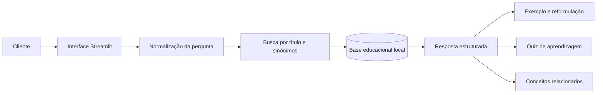

# 📚 Primeiro Aporte

> **Aprenda antes de investir.**

O Primeiro Aporte é um guia educacional que ajuda clientes iniciantes a compreender investimentos em linguagem simples. A experiência combina trilhas de aprendizagem, explicações alternativas, exemplos cotidianos e verificações rápidas de conhecimento.

O projeto funciona integralmente com uma base local: não utiliza OpenAI, APIs externas, dados bancários ou informações pessoais.

## 🎬 Vídeo de pitch

### [▶️ Assistir ao pitch do Primeiro Aporte](https://github.com/BrunoVit0r/primeiro-aporte/raw/refs/heads/main/assets/pitch-primeiro-aporte.mp4)

[⬇️ Baixar o vídeo em MP4](https://raw.githubusercontent.com/BrunoVit0r/primeiro-aporte/main/assets/pitch-primeiro-aporte.mp4)

O vídeo apresenta o problema, a proposta de valor, a experiência do usuário e os diferenciais do projeto. Os links utilizam a versão `raw` porque o GitHub não gera preview na página de arquivos grandes.

## O problema

Termos como CDB, FII, ETF, liquidez e renda fixa aparecem com frequência nos canais financeiros, mas nem sempre são explicados de forma acessível. Para quem está começando, isso pode gerar insegurança e dificultar decisões conscientes.

## A solução

O Primeiro Aporte transforma uma consulta isolada em uma pequena jornada de aprendizagem:

1. o usuário escolhe uma trilha ou faz uma pergunta;
2. o sistema encontra o conceito na base local;
3. apresenta definição, funcionamento, pontos importantes, riscos e exemplo;
4. permite pedir outra explicação ou destacar um exemplo;
5. oferece uma verificação rápida do aprendizado;
6. sugere conceitos relacionados para continuar estudando.

## Diferenciais

- **Aprendizado guiado:** trilhas de primeiros passos, renda fixa e renda variável.
- **Explicação adaptável:** opção de explicar o mesmo conceito de outra maneira.
- **Exemplos simples:** situações didáticas próximas do cotidiano.
- **Verificação de conhecimento:** questões locais com feedback imediato.
- **Progresso visível:** conceitos explorados durante a sessão.
- **Continuidade:** sugestões de assuntos relacionados.
- **Acessibilidade:** tipografia ampliada, alto contraste e áreas de interação maiores.
- **Privacidade:** nenhuma pergunta ou informação é enviada para serviços externos.
- **Auditabilidade:** todas as respostas vêm de um único arquivo JSON revisável.

## Exemplos de perguntas

- O que é investimento?
- O que é CDB?
- O que são fundos imobiliários?
- Como funciona o Tesouro Direto?
- Qual é a diferença entre renda fixa e renda variável?
- Por que diversificar os investimentos?

## Arquitetura



| Camada | Tecnologia | Responsabilidade |
|---|---|---|
| Interface | Streamlit | Trilhas, consultas, histórico e progresso |
| Motor educacional | Python | Busca, normalização e montagem das respostas |
| Conhecimento | JSON | Conceitos, sinônimos, riscos e exemplos |
| Qualidade | Pytest e Streamlit AppTest | Testes do conteúdo, fluxo e interface |

## Estrutura do projeto

```text
primeiro-aporte/
├── assets/
│   └── pitch-primeiro-aporte.mp4
├── data/
│   └── base_educacional.json
├── docs/
│   ├── 01-documentacao-agente.md
│   ├── 02-base-conhecimento.md
│   ├── 03-prompts.md
│   ├── 04-metricas.md
│   └── 05-pitch.md
├── examples/
├── src/
│   ├── agent.py
│   ├── app.py
│   ├── config.py
│   ├── knowledge.py
│   └── requirements.txt
├── tests/
└── README.md
```

## Como executar

Requisitos: Python 3.11 ou superior.

No PowerShell:

```powershell
cd C:\Users\bvbru\Desktop\primeiro-aporte
py -m venv .venv
.\.venv\Scripts\Activate.ps1
python -m pip install --upgrade pip
python -m pip install -r src\requirements.txt
python -m streamlit run src\app.py
```

Se a ativação do ambiente virtual estiver bloqueada:

```powershell
Set-ExecutionPolicy -Scope Process Bypass
.\.venv\Scripts\Activate.ps1
```

## Testes

```powershell
python -m pytest -q
```

A suíte verifica a integridade da base, recuperação de conceitos, respostas educacionais, trilhas, progresso, ações de reforço, rolagem e estrutura da interface.

## Segurança e limitações

- Não executa investimentos ou operações bancárias.
- Não acessa contas, saldos, senhas ou dados pessoais.
- Não fornece cotações ou taxas em tempo real.
- Não recomenda compra ou venda de produtos.
- Não promete rentabilidade.
- Não substitui orientação profissional.

> **Aviso:** conteúdo exclusivamente educacional. Não constitui recomendação de investimento.
