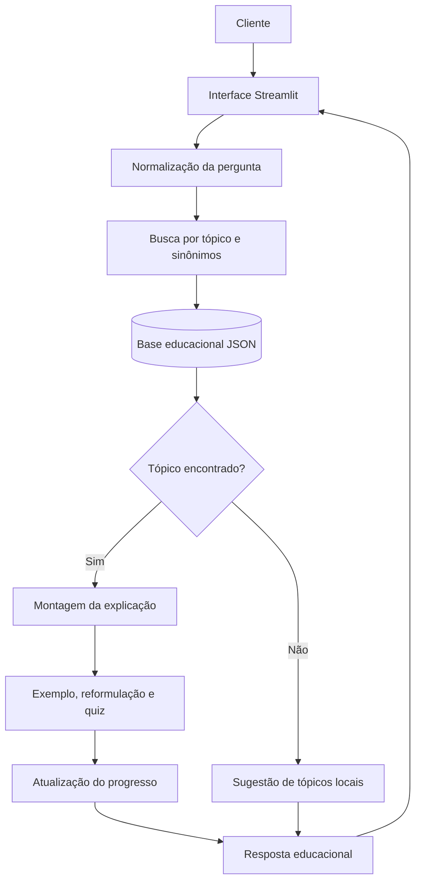

# Documentação do Agente

## Caso de Uso

### Problema
Muitos clientes bancários querem começar a investir, mas não entendem expressões como CDB, renda fixa, fundos imobiliários, liquidez e diversificação. A linguagem técnica pode gerar insegurança, decisões apressadas e dependência de informações sem contexto.

### Solução
O **Primeiro Aporte** é um protótipo acadêmico de agente educacional que parte do princípio “aprenda antes de investir” e:

- recebe perguntas livres sobre conceitos básicos de investimento;
- identifica o assunto e seus sinônimos em uma base local;
- explica definição, funcionamento, pontos importantes, riscos e cuidados;
- apresenta um exemplo simples para facilitar o aprendizado;
- organiza o conteúdo em trilhas de primeiros passos, renda fixa e renda variável;
- registra o progresso dos conceitos explorados durante a sessão;
- reformula explicações e oferece verificações rápidas de aprendizagem;
- informa quando um assunto não existe na base, sem inventar respostas;
- funciona integralmente de forma local, sem OpenAI ou APIs externas.

### Público-alvo
Clientes pessoas físicas iniciantes em investimentos, especialmente quem precisa compreender conceitos fundamentais antes de avaliar produtos ou conversar com um especialista.

## Persona e Tom de Voz

### Nome do Agente
**Primeiro Aporte** — nome conceitual para o desafio. Seu slogan é **“Aprenda antes de investir.”** Este projeto é acadêmico e não representa um produto bancário oficial.

### Personalidade
Didática, acolhedora, paciente, objetiva e transparente. O agente ensina sem pressionar, julgar ou transformar uma explicação em recomendação de compra.

### Tom de Comunicação
Português claro, frases diretas, termos técnicos explicados, exemplos cotidianos e alertas proporcionais ao assunto.

### Exemplos de Linguagem
- Saudação: “Olá! Posso explicar conceitos de investimento de forma simples. O que você gostaria de aprender?”
- Explicação: “CDB é um título de renda fixa emitido por bancos para captar recursos.”
- Cuidado: “Renda fixa não significa ausência de risco.”
- Limitação: “Ainda não encontrei esse assunto na minha base local.”

## Arquitetura

### Componentes

| Componente | Implementação | Responsabilidade |
|---|---|---|
| Interface | Streamlit | Exibir cabeçalho, trilhas, histórico e formulário de consulta acessível |
| Base de conhecimento | JSON local | Armazenar tópicos educacionais auditáveis |
| Carregamento | Python | Ler e validar a base local |
| Normalização | Python | Ignorar diferenças de caixa, acentos e pontuação |
| Busca determinística | Python | Encontrar o tópico pelo título ou sinônimos |
| Resposta | Template local | Organizar explicação, funcionamento, riscos e exemplo |
| Jornada educacional | Estado da sessão | Controlar trilhas, progresso e último conceito estudado |
| Verificação | Quiz determinístico | Reforçar o conceito com feedback imediato |
| Validação | Pytest e AppTest | Testar conteúdo, busca e interface |

## Segurança e Anti-Alucinação

### Estratégias adotadas
- Respostas limitadas ao conteúdo de `data/base_educacional.json`.
- Nenhuma chamada de rede ou integração com modelo externo.
- Busca determinística, sem geração livre de conteúdo.
- Fallback explícito quando o tópico não existe.
- Ausência de perfis, contas, saldos, transações e dados pessoais.
- Nenhuma cotação ou taxa atual apresentada.
- Aviso educacional ao final das respostas.
- Riscos e cuidados documentados em todos os tópicos.

### Limitações declaradas
O Primeiro Aporte não executa aplicações, não movimenta contas, não acessa sistemas bancários, não fornece cotações ou taxas em tempo real, não personaliza recomendações, não substitui profissional habilitado e não garante rentabilidade. Seu objetivo é exclusivamente educacional.
